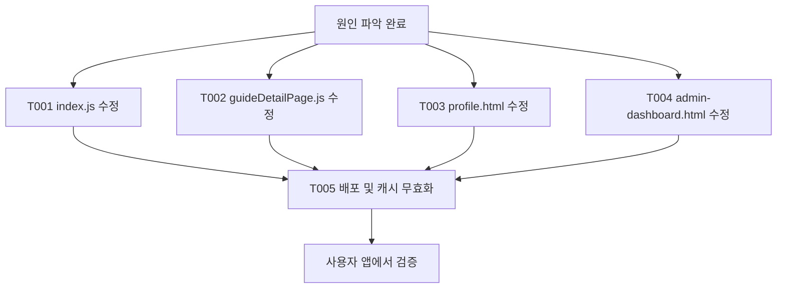

# 2026-03-05 앱 최적화 추진계획

**작성일**: 2026년 3월 5일  
**프로젝트**: 내손안에 가이드 (누비)  
**환경**: Replit 풀스택, Expo WebView, 구글 플레이 내부 테스트

---

## 1. 개요

### 1.1 배경
- TTS(음성 읽어주기) 버튼이 여러 화면에서 동작 방식이 다름
- 일부 화면: 가이드 열면 자동으로 소리가 남
- 일부 화면: ▶ 버튼을 눌러야만 재생됨
- 사용자 요청: **모든 화면에서 동일하게** ▶ 버튼만 보이고, 사용자가 탭해서 재생하도록 통일

### 1.2 목표
- TTS 자동재생을 **모든 페이지에서 제거**
- 텍스트/가이드 준비 시 **▶ 버튼만 표시**
- 사용자가 직접 탭해 재생하도록 통일

### 1.3 핵심 원칙 (절대 준수)
> **원인과 해결책을 완전히 파악하기 전에는 코드 수정 금지**  
> 섣부른 추정 수정은 더 큰 문제를 일으킬 수 있음

---

## 2. 문제점

### 2.1 사용자 앱에 수정이 반영되지 않음
- "수정했다"고 했으나 실제 사용자 앱 버전에는 적용되지 않음
- 가이드 열면 여전히 자동으로 소리가 나는 화면 존재
- ▶ 버튼을 눌러도 재생되지 않는 경우 존재

### 2.2 화면별 현재 동작 (검수 결과)

| 화면 | 파일 | 현재 동작 | 목표 동작 |
|------|------|-----------|-----------|
| 메인 가이드 생성 | index.js | ▶ 탭 시 재생 안 됨 가능성 | 탭 시 즉시 재생 |
| 보관함 미리보기 | guideDetailPage.js | 가이드 열면 자동재생 | ▶ 버튼만 표시, 탭 시 재생 |
| 프로필(내 가이드) | profile.html | 가이드 열면 자동재생 | ▶ 버튼만 표시, 탭 시 재생 |
| 관리자 대시보드 | admin-dashboard.html | 가이드 열면 자동재생 | ▶ 버튼만 표시, 탭 시 재생 |
| 공유 페이지 v2 | shared-template/v2.js | 이미 수동 트리거 | 수정 불필요 |
| 공유 페이지 | share-page.js | 이미 수동 트리거 | 수정 불필요 |

---

## 3. 원인 분석

### 3.1 코드 미적용 (1차 원인)
2026-03-05 검수 결과, **T001~T004 수정이 실제 코드에 반영되지 않은 상태**로 확인됨.

### 3.2 코드 검수 상세

#### T001: index.js — 미적용
- **위치**: `public/index.js` 3984~3990줄
- **현재 코드**: `sentences.forEach` 루프 끝에 `speakNext()` 호출 없음
- **문제**: `queueForSpeech()`만 호출하고 `speakNext()`가 없어, 특정 조건에서 탭해도 재생이 시작되지 않을 수 있음

#### T002: guideDetailPage.js — 미적용
- **위치**: `public/components/guideDetailPage.js` 567~571줄
- **현재 코드**: `this._playAudio(guide.description, ...)` — 자동재생
- **주석**: "2026-01-19: 사용자 제스처 컨텍스트 유지를 위해 즉시 TTS 재생"

#### T003: profile.html — 미적용
- **위치**: `public/profile.html` 1277~1282줄
- **현재 코드**: `_retranslateNewContent().then()` 안에서 `this._playAudio(...)` 호출

#### T004: admin-dashboard.html — 미적용
- **위치**: `public/admin-dashboard.html` 1562~1567줄
- **현재 코드**: T003과 동일한 패턴

### 3.3 배포·캐시 관련 (2차 원인, 수정 후에도 미반영 시)
- **Service Worker**: `public/service-worker.js`가 캐시 우선 전략 사용 → 이전 JS/HTML 제공 가능
- **index.js 버전**: `index.html`에서 `index.js?v=20260124e` 사용 → 버전 미갱신 시 캐시 유지
- **Expo WebView**: 앱 내 웹뷰가 이전 버전 캐시 사용 가능
- **배포 미실행**: Replit 배포가 되지 않았거나 새 빌드 미배포

---

## 4. 해결방안 (TODO 리스트)

### T001: index.js — onAudioBtnClick()에 speakNext() 추가
- **상태**: [ ] 미완료
- **파일**: `public/index.js`
- **위치**: `onAudioBtnClick()` 함수 끝, `sentences.forEach` 루프 직후
- **변경 전**:
  ```javascript
  sentences.forEach((sentence, index) => {
      if (sentence.trim() && spans[index]) {
          queueForSpeech(sentence.trim(), spans[index]);
      }
  });
  }
  ```
- **변경 후**:
  ```javascript
  sentences.forEach((sentence, index) => {
      if (sentence.trim() && spans[index]) {
          queueForSpeech(sentence.trim(), spans[index]);
      }
  });
  speakNext();
  }
  ```
- **효과**: ▶ 버튼 탭 시 TTS 재생이 확실히 시작됨
- **Blocked By**: 없음

---

### T002: guideDetailPage.js — 자동재생 제거, ▶ 버튼 표시로 대체
- **상태**: [ ] 미완료
- **파일**: `public/components/guideDetailPage.js`
- **위치**: 약 567~571줄 (가이드 렌더 시)
- **변경 전**:
  ```javascript
  if (guide.description) {
      this._playAudio(guide.description, guide.voiceLang, guide.voiceName, renderId);
  }
  ```
- **변경 후**:
  ```javascript
  if (guide.description) {
      this._updateAudioButtonIcon(false);
  }
  ```
- **효과**: 가이드 열면 ▶ 버튼만 표시, 자동재생 없음. 탭 시 `_toggleAudio()` → 재생
- **Blocked By**: 없음

---

### T003: profile.html — 자동재생 제거, ▶ 버튼 표시로 대체
- **상태**: [ ] 미완료
- **파일**: `public/profile.html`
- **위치**: 약 1277~1282줄 (`_retranslateNewContent().then()` 콜백 안)
- **변경 전**:
  ```javascript
  this._retranslateNewContent().then(() => {
      if (guide.description) {
          this._playAudio(guide.description, guide.voiceLang, guide.voiceName, renderId);
      }
  });
  ```
- **변경 후**:
  ```javascript
  this._retranslateNewContent().then(() => {
      if (guide.description) {
          this._updateAudioButtonIcon(false);
      }
  });
  ```
- **효과**: T002와 동일
- **Blocked By**: 없음

---

### T004: admin-dashboard.html — 자동재생 제거, ▶ 버튼 표시로 대체
- **상태**: [ ] 미완료
- **파일**: `public/admin-dashboard.html`
- **위치**: 약 1562~1567줄
- **변경 내용**: T003과 동일
- **Blocked By**: 없음

---

### T005: 배포 및 캐시 무효화
- **상태**: [ ] 미완료
- **선행 조건**: T001, T002, T003, T004 완료
- **작업 목록**:
  1. [ ] 개발 서버 재시작 (`restart_workflow`)
  2. [ ] 로컬/개발 환경에서 동작 확인
  3. [ ] Replit 배포 실행
  4. [ ] `index.html`의 `index.js?v=20260124e`를 새 버전으로 변경 (예: `v=20260305`)
  5. [ ] `service-worker.js`의 `CACHE_NAME`을 새 버전으로 변경 (예: `v40`)
  6. [ ] 사용자 안내: 앱 삭제 후 재설치 또는 캐시 삭제 후 재실행
- **Blocked By**: T001, T002, T003, T004

---

### 수정 불필요 (이미 수동 트리거)
- `shared-template/v2.js` — 확인 완료
- `share-page.js` — 확인 완료

---

## 5. 기대효과

### 5.1 사용자 경험
- 모든 화면에서 **동일한 방식**으로 음성 재생 (▶ 버튼 탭 → 재생)
- 원치 않는 자동재생 제거로 사용자 선택권 강화
- 예상치 못한 소리 재생 감소

### 5.2 기술적 효과
- TTS 동작 방식 통일로 유지보수 용이
- iOS Safari 등 자동재생 정책과의 충돌 가능성 감소

---

## 6. 실행 순서



---

## 7. 관련 파일 목록

| 구분 | 파일 경로 |
|------|-----------|
| 수정 대상 | `public/index.js` |
| 수정 대상 | `public/components/guideDetailPage.js` |
| 수정 대상 | `public/profile.html` |
| 수정 대상 | `public/admin-dashboard.html` |
| 배포 시 확인 | `public/index.html` (index.js 버전 파라미터) |
| 배포 시 확인 | `public/service-worker.js` (CACHE_NAME) |
| 수정 불필요 | `shared-template/v2.js` |
| 수정 불필요 | `share-page.js` |

---

## 8. 용어 설명 (비개발자용)

| 용어 | 설명 |
|------|------|
| TTS | 텍스트를 음성으로 읽어주는 기능 |
| 자동재생 | 화면을 열면 사용자 동작 없이 소리가 나는 것 |
| ▶ 버튼 | 재생 버튼. 탭하면 음성이 재생됨 |
| 캐시 | 앱/브라우저가 예전 버전을 저장해 두는 것 |
| 배포 | 수정된 내용을 실제 서비스에 반영하는 것 |
| Service Worker | 웹앱이 오프라인에서도 동작하도록 캐시를 관리하는 기술 |

---

*문서 끝*
